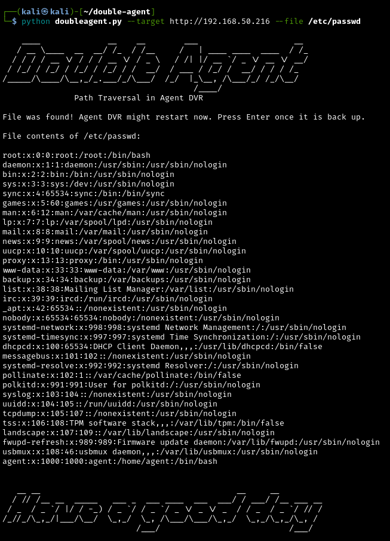

# Double Agent



## Background

Agent DVR is security monitoring software. Versions <= 6.6.1.0 are vulnerable to local path traversal on the 'addrecording' API call. This can be combined with the 'streamFile.cgi' local API call to fetch local files. Both of these calls are unauthenticated, and work even if a user has specified a username/password in the UI. I haven't tested this against a remote (paid) Agent DVR instance. It probably won't work.

I've tested this against fresh installs of the latest version (6.6.1.0) as well as version 6.2.7.0. The exploit works against both Linux and Windows, but the --os flag must be specified accordingly when running.

This vulnerability is included within [CVE-2025-63408](https://nvd.nist.gov/vuln/detail/CVE-2025-63408).

## Usage

To run Double Agent:
```
python3 doubleagent.py [-h] --target TARGET [--port PORT] --file FILE [--os {windows,linux}]
```
There are no fancy imports, so you should be able to run the script with out-of-the-box Python3.

## Links

- [Agent DVR](https://www.ispyconnect.com/)
- [Agent DVR Local API Docs](https://ispysoftware.github.io/Agent_API/)
- [My Website!](https://www.ericholub.com)
